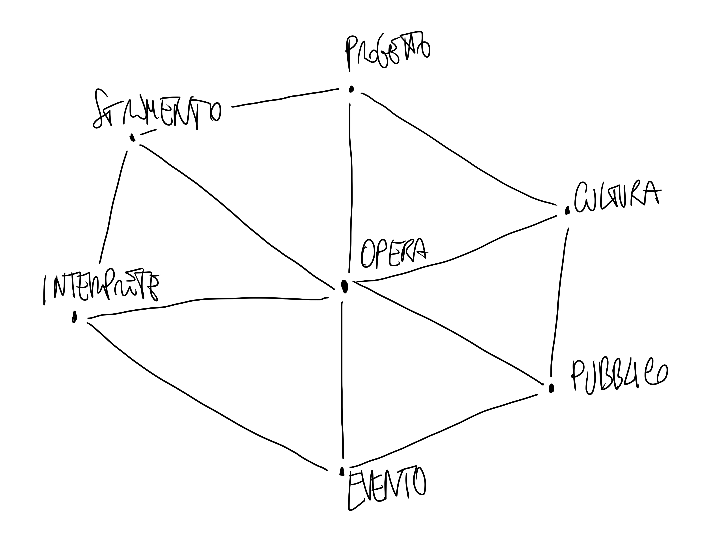

> Nella nostra anima c'è\\
  una incrinatura che, se sfiorata,\\
  risuona come un vaso prezioso\\
  riemerso dalle profondità	della terra

## introduzione

Ho desiderato, e a lungo provato, di trovarmi nella circostanza di una ricerca
scientifica, istituzionalizzata. Mi sono portato in sala anecoica[^1].
Ho ripetutamente ed inutilmente cercato il supporto di un'istituzione[^2].
Ho fallito l'approccio ad un finanziamento europeo[^3]. Ho cercato continuamente
_qualcosa_ che potesse sollevare lo stato dell'arte della ricerca dal livello domestico in cui è nata ad un livello scientifico, istituzionalizzato. Ero
convinto che per parlare di temi come lo spazio sonoro, l'ascolto e la
produzione di strumenti in grado di manipolarli, si dovesse necessariamente
passare per un percorso di divulgazione scientifica riconosciuta. In quel modo, certificandomi, mi sarei sentito parte di una comunità. Ho osservato i miei
continui fallimenti, motivandoli, laddove mi è stato possibile capire. Ho
compreso una verità del mio tempo contemporaneo, delle istituzioni e del
mondo accademico-scientifico, sulla quale proverò a scrivere più accuratamente
altrove.

[^1]: _IRCAM_, 2018. Con l'aiuto e la presenza fondamentale di Marco Matteo
Markidis, amico, compositore, ricercatore indipendente, ho passato una
settimana nel centro parigino occupando la sala anecoica, ospite di Josè
Fernandez Rodriguez, allora ricercatore _IRCAM_. Il viaggio e l'alloggio
furono auto-sostenuti, auto-prodotti, allo scopo di testare e rilevare dati
sugli altoparlanti _S.T.ONE_ e il neonato _S.T.ON3L_ (nato la notte prima di
partire, dopo una lunga gestazione).

[^2]: Dottorati e residenze, una decina tra il 2016 e il 2019.

[^3]: Nel 2018 attraverso un bando di _LazioInnova_ è nata _Spherical Technologies SRLS_, con lo scopo di produrre commercialmente le ricerche sui dispositivi
sferici di ripresa e diffusione fino ad allora sviluppati. Ma l'imprenditore
che è in me è un incapace totale ed il progetto non ha portato altro che
spese aggiuntive sotto il capitolo _costi di istituzionalizzazione_, perdendo
quindi l'accesso ai fondi per lo sviluppo.

## sala da concerto

Ad un certo punto ho iniziato ad osservare quello che avevo fatto nel contesto
in cui tutto è nato, la sala da concerto. Il contesto, la circostanza, alla luce
di questo nuovo sguardo, è passato da essere sfondo, distante e sbiadito, a
superficie, piano complesso su cui ho disegnato i miei poli e i miei zeri. Mi
sono visto filtro di una struttura sonora che si staglia lungo la storia della
scuola elettroacustica romana, mi sono reso conto che il luogo non poteva
che essere quello, una sala da concerto e non un'istituzione in grado di
dialogare, e quindi comprendere e parlare, la mia stessa lingua. E non perché
non lo volessi, ma perché ho riconosciuto che, nella storia di cui mi sono visto
parte, questo non è mai accaduto, questo luogo non c'è mai stato. Un luogo dove
tutto è cresciuto senza alcun tipo di supporto, fatta esclusione del sostegno
diretto di qualche caro amico che finirà, in un modo o nell'altro, tra queste
pagine.

Tra le mura del _Conservatorio S. Cecilia_, dove non potrà mai esserci una
sala anecoica, c'è una delle sale da concerto più belle d'Italia (non è
oggettivamente vero, ma poco importa, come spesso accade per la bellezza). In
quei luoghi sono cresciuti i miei orecchi e la mia percezione ha catturato
particolari affinché fossi in grado di comporre, nel tempo, un pensiero generale.
In quel pensiero c'è stato spazio per la creazione musicale, quella tipica
della scuola in cui sono nato, direttamente con le parole dei miei maestri:
una _scuola del fare_ (Giorgio Nottoli), nel suo rapporto complesso tra
_progetto-strumento-opera_ (Michelangelo Lupone).

Lo studio delle relazioni tra spazio acustico, rito del concerto, strumento,
interprete, pubblico e compositore hanno permesso lo sviluppo di una ricerca
musicale articolata e complessa, domestica ma non per questo meno rigorosa di
una ricerca scientifica istituzionalizzata, non per questo inutile.

_Pensare tetraedrico oggi_ significa guardare al pensiero di Alan Blumlein
e Michael Gerzon e cercare di capire cosa ne è rimasto nel pensiero altrui.
Non scoraggiarsi davanti all'abuso di superficialità a cui sono sottoposte
parole come ascolto, suono, stereofonia. Non limitarsi al collegamento
Gerzon-Ambisonic, o agli epiloghi solipsistici proposti nelle realtà virtuali,
che non rivendicano senso di appartenenza a quell'elegante modo di descrivere
gli spazi sonori delle infinite realtà acustiche attraverso il concetto delle armoniche sferiche. Non limitarsi all'idea di una tecnologia che si pone solo
al servizio di un fine, ormai esclusivamente ludico e di intrattenimento, ma
che possa essere il mezzo stesso di speculazione sulle potenzialità tecniche
reali del produrre e riprodurre suoni. Si tratta, in fondo, e fin dal principio,
di un pensiero estremamente musicale.

A questo e di questo scrivo, alla possibilità reale di portare avanti una
ricerca, destinarla ad un pubblico, divulgando il pensiero musicale che l'ha
permessa e che la sostiene. Ho visto crescere la ricerca e l'interesse attorno ad
essa, e seppur non avesse tutti i requisiti per stabilire una validità scientifica
aveva la dignità di fatto, di aver fatto i conti con la musica (nella sua
polimorfa struttura di tempo, spazio, memoria). Non una situazione anecoica,
_che non dà luogo a fenomeni di eco_, ma la realtà acustica del vivo musicale è
stato il banco di prova e l'ambiente di ricerca del mio pensiero e su questa
mi auguro di avere confronto.
