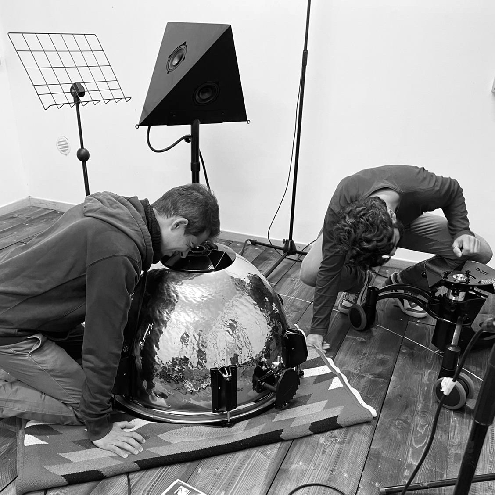

## Timpani Electro Magnetic Pulse Oscillation

La musica è uno strumento di pensiero. Gli strumenti musicali che scegliamo,
inventiamo, con cui attiviamo esperienze sonore e articoliamo musica, sono a
loro volta strumenti di pensiero. Lo strumento _TEMPO_
(_Timpani Electro-Magnetic Pulse Oscillation_) nasce dalla necessità costante
di nuovi strumenti di pensiero che proiettino la coscienza, che è memoria, nel
futuro musicale. Il _TEMPO_ strumento del tempo.

La _Scuola Romana_ nella quale mi sono formato musicalmente ha una lunga
tradizione di strumenti elettroacustici d'invenzione, risalenti a quella che
potremmo definire l'alba dello strumento elettroacustico di ricerca musicale,
fin negli anni cinquanta del XX secolo. Tuttavia, la storia del timpano è molto
più antica e risale a ritroso, direi completamente, la storia della musica. Su
questa tela temporale di ricerca e creatività intendo, col _TEMPO_, indagare
il passato proteso verso un _altro_ pensiero musicale e, in quanto pensiero
condiviso, strumento sociale.

Il _TEMPO_ produce vibrazioni acustiche mediante attivazione elettromagnetica
della membrana tesa di un timpano orchestrale[^1]. La vibrazione è prodotta da
un sistema induttivo indossato dal musicista e trasmessa alla membrana
attraverso dei vincoli magnetici. Accade che il segnale audio analogico prodotto
da quattro microfoni, in condizione di riprendere le vibrazioni della membrana,
attraversi i due modulatori elettromagnetici e, a distanza, senza contatto,
riesca a _muovere la membrana del timpano_ (nel senso ambivalente di vibrazione
meccanica, acustica e sensazione uditiva di suono).

In questo senso lo strumento _TEMPO_ non altera i principi fisici dello
strumento timpano tradizionale che rimane dunque meravigliosa eredità storica,
gioiello tecnologico di coscienza umana, intera letteratura e memoria
proiettata nel futuro delle possibilità di attivazione sonora della membrana
a tensione variabile.

[^1]: Modello di riferimento _ADAMS Revolution 29"_ in rame martellato, con sistema di _fine tuning_.

Il ruolo giocato dalla posizione del magnete sulla membrana del timpano è
cruciale in quanto può agire da vincolo (nodo) o da leva (ventre) nella
stimolazione della vibrazione acustica. Seppur di dimensioni finite, la
superficie di movimento offerta dalla membrana per questi vincoli tende ad
un infinito spazio timbrico. Considera la presenza simultanea di due
magneti mobili il sistema dispone simultaneamente di due spazi: lo spazio
assoluto nei confronti della superficie; e lo spazio relativo ai due vincoli.

L'esplorazione del _TEMPO_ infinito può essere quindi affrontata spazializzando,
discretizzando le possibilità e riducendole a luoghi conosciuti, ritrovabili nel
_TEMPO_. In altre parole condurre lo spazio universale a convergere a un
sistema complesso.

La produzione di vibrazioni acustiche sul _TEMPO_ avviene mediante
l'avvicinamento ai due magneti, solidali alla membrana, dei due sistemi
d'induzione elettromagnetica denominati _EMP_ (_Abbott_ e _Costello_). Il
principio di funzionamento è assimilabile a quello di un tradizionale
altoparlante: un segnale elettrico alimenta una bobina che mediante l'induzione
di un campo elettromagnetico provoca la vibrazione molto rapida di un corpo
metallico; a questo corpo mobile è solidale un materiale sospeso, elastico
e a sua volta libero di vibrare. In luogo del tradizionale cono di cartone o
materiale plastico presente sul diffusore acustico, nel _TEMPO_, a vibrare
sospesa ed elastica, è la membrana stessa del timpano. L'avvicinamento quindi
dei due sistemi di induzione elettromagnetica può attivare, uno alla volta o
entrambi, vibrazioni controllate e predicibili della superficie.

L'uso del pedale del timpano rimane inalterato e garantisce l'escursione di
tensione e frequenza di vibrazione necessaria alla produzione timbrica dello
strumento.

## Progetto Lazzaro
